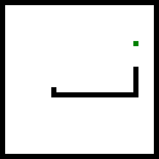

# Build a JavaScript game (Makers Academy workshop)

* By Mary Rose Cook
* https://maryrosecook.com
* mary@maryrosecook.com

## Code for this workshop

https://github.com/maryrosecook/build-your-own-javascript-game-workshop

## The itinerary

1. I'll livecode Space Invaders from scratch.
2. We'll briefly dissect the architectural approach I used.
3. We'll talk about an approach for testing game code.
4. You'll choose what game to implement: Snake, Asteroids, Lunar Lander.
5. You'll spend the rest of the workshop implementing your game.  I'll
be here to troubleshoot and give advice.

## The aims of this workshop

Every game has different, gameplay-specific problems that need to be solved.
The solutions to these problems are different for different games.
If this workshop were about how to do animation, or player movement,
or collision resolution, it would not be very useful.  The techniques
I presented would be useful for some games, but not others.

This workshop is based around letting you practice using an
architectural approach that is good for building 2D action games.
This approach can be applied to many different games.  It scales to
ten, a hundred or a thousand times as many lines of code.

This workshop will also let you complete, or make good progress on,
your first game.

## Space Invaders

The code is in `game.js`.

## Running the game

### Install Python 2

### Run Space Invaders game

To serve the Space Invaders code

    $ cd build-a-javascript-game-workshop/space-invaders/
    $ python -m SimpleHTTPServer 4000
    $ open index.html

### Run livecoded game

To serve the livecoded code

    $ cd build-a-javascript-game-workshop/livecoded-game/
    $ python -m SimpleHTTPServer 4000
    $ open index.html

## Running the tests

    $ cd build-a-javascript-game-workshop/
    $ npm install
    $ npm test

## What game to make?

### Snake

Reasonably simple.  Probably the best example for focusing on the
architecture and not getting bogged down in implementation details.

### Asteroids

Requries some trigonometry to detect when lines are intersecting.

### Lunar Lander

Requires some trigonometry to detect when lines are intersecting.  Also fiddly
because the lander has to be able to rest on the landing pad.

## How to get started

1. Get a black square drawing on the canvas.

2. Create a game tick function and get it running many times a second.

3. Create a player body and get its `update()` and `draw()` functions running.

4. Use the keyboard to move the player around.

5. ...

## Canvas drawing reference

See `canvas-drawing-reference.md` in the root of this repo.  It has
code for drawing lines, polygons and circles, and setting colours.
